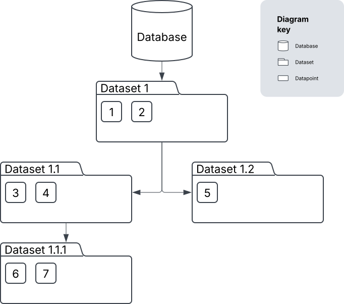

.. Hierarchical Arbitrary Data Storage (HARDS) documentation master file, created by
   sphinx-quickstart on Tue Mar 25 11:59:08 2025.
   You can adapt this file completely to your liking, but it should at least
   contain the root `toctree` directive.

Hierarchical Arbitrary Data Storage (HARDS)
=============================================

.. contents:: Page Contents
    :depth: 2

An API for managing hierarchical datasets in Python with a simple pure-Python local
filesystem implementation.

Prologue
--------
The principle of HARDS is to manage data with a hierarchy of datasets that reflects the natural
organisation of the data--it will not be appropriate for some (maybe most) organisations of data.

|

HARDS originates from a Bayesian optimisation (BO) project at the UK Atomic Energy Authority for placing
magnetic coils inside of a nuclear fusion device [#BO]_.
BO is one such application where a natural hierarchy of datasets can exist:

#. Data that is sampled using a (quasi-)Monte Carlo method.
#. Data that is subsequently sampled using an 'intelligent' algorithm with the aim of
   minimising some objective functions subject to several constraints.

The datasets are distinguished by sampling method, and the second is derived from the first,
creating a hierarchy.

|

HARDS implements this idea in a tree-like structure:

* The root node is the databse.
* The internal nodes are datasets.
* The leaf nodes are datapoints.

| **Database**: where the data is located.
| **Dataset**: a collection of related data (e.g. samples of a physics simulator).
| **Datapoint**: a single unit of data (e.g. a sample of the simulator at one point in parameter-space).

*Data flows down the tree.*

Meaning, a dataset has 'access' to its own datapoints plus all of the datapoints in the datasets
forming the path to the root.

Consider the following example:

The datasets each have access to the following datapoints:

* **Dataset 1**: 1, 2
* **Dataset 1.1**: 1, 2, 3, 4
* **Dataset 1.2**: 1, 2, 5
* **Dataset 1.1.1**: 1, 2, 3, 4, 6, 7

Remember that there could be several other top-level datasets on the same level as 'Dataset 1'.

Contents
--------
The remaining documetation is split into two sections.

The API section defined the API, which is formed by the abstract Python interface and
further detail in the classes's docstrings.

.. toctree::
   :maxdepth: 1

   api

The filesystem section details an implementation of the API using the local filesystem.
It includes several examples of working with the HARDS filesystem implementation in Python.

.. toctree::
   :maxdepth: 1

   filesystem

References
----------

.. [#BO] Nunn, T., Pentland, K., Gopakumar, V., & Buchanan, J. (2025). Bayesian optimisation of poloidal field coil positions in tokamaks. arXiv preprint arXiv:2503.17189.

Indices and tables
==================

* :ref:`genindex`
* :ref:`modindex`
* :ref:`search`
